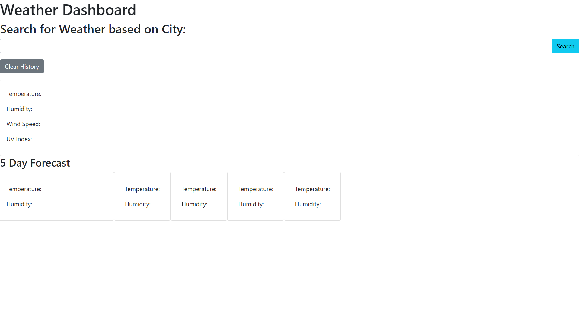

# Weather-Dashboard

## Description 
I want to be able to see the weather across several cities as I travel. The current weather for the day should be shown based on the city searched in the search bar. There should also be a history of your previous searches and a clear history button in order to clear your previous searches. The forecast for the next 5 days should also be shown as well. The date, temperature, humidity, wind speed, and UV index are shown as well as changing icons depending on the weather. It was quite difficult trying to get all of these moving parts to work together as well as doing so in the short amount of time we were given and while working on a group project. 

## Link to Deployed Application 
https://tjl2125.github.io/Weather-Dashboard/

## Screenshot 
 

## Credits
https://openweathermap.org/forecast5